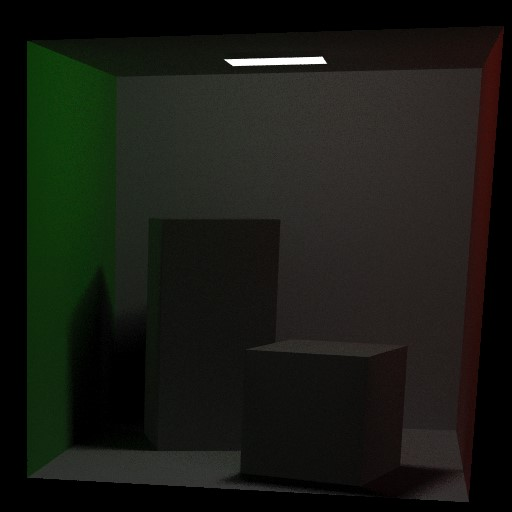

A **web** toy ray tracer made using **compute shaders**.

:boom: [Demo](https://oktomus.github.io/webgpu-toy-ray-tracer/)

------------------

While this ray tracer is not physically correct and boring, it's a good example of what you can acheive with compute shaders in web.

This was made possible thanks to WebGL 2.0 Compute, an experimental feature currently available on Google Chrome (Linux or Windows).

Many thanks to [9ballsyndrome](https://github.com/9ballsyndrome) for his help and especially for his repository [WebGL_Compute_shader](https://github.com/9ballsyndrome/WebGL_Compute_shader) where you can some cool stuff made using WebGL 2.0 Compute.

If you are interested into compute shaders for the web, here are some links:
- [WebGL 2.0 Compute Editor’s Draft](https://www.khronos.org/registry/webgl/specs/latest/2.0-compute/)
- [WebGL 2.0 Compute for emscripten](https://github.com/emscripten-core/emscripten/pull/7612)
- [Khronos group wiki](https://www.khronos.org/webgl/wiki/Main_Page)
